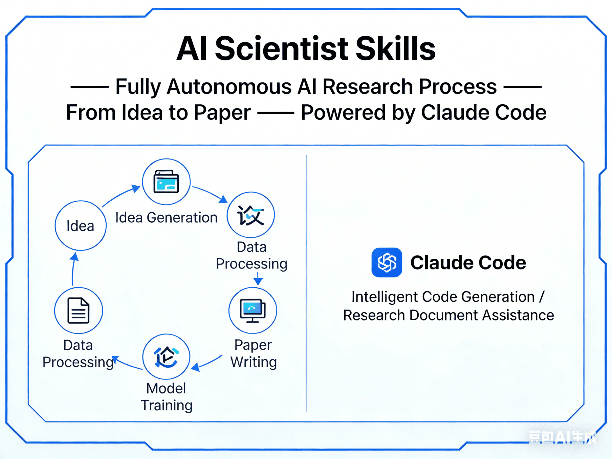

<div align="center">

  

  <p>
    
    
    
    
  </p>

</div>

> Re-implements the complete [AI-Scientist-v2](https://github.com/SakanaAI/AI-Scientist) research pipeline as [Claude Code](https://claude.ai/claude-code) skills. One agent handles ideation, experiments, plotting, paper writing with built-in fact-checking, and multi-layer peer review.

## Quick Start

### Prerequisites

- [Claude Code](https://claude.ai/claude-code) CLI
- [uv](https://docs.astral.sh/uv/) (Python package manager)
- Python 3.11+
- LaTeX (`pdflatex` + `bibtex`)

```bash
# macOS
brew install --cask basictex

# Ubuntu / Debian
sudo apt install texlive-full
```

### Install

```bash
cd your-research-project
curl -fsSL https://raw.githubusercontent.com/stamate/ai-scientist-skills/main/scripts/install.sh | bash
```

This single command:
- Creates `.venv` with all Python deps (torch, numpy, matplotlib, transformers, etc.)
- Installs 8 Claude Code plugins at project scope
- Updates marketplace caches to latest versions
- Generates `CLAUDE.md` with environment instructions
- Verifies the installation

### Run

```bash
claude '/ai-scientist'                    # interactive — guides you through topic creation
claude '/ai-scientist --workshop topic.md' # from a workshop description
```

## Core Pipeline

```
 Ideation ───→ Experiment ───→ Plots ───→ Paper ───→ Review
    │              │              │          │          │
    ▼              ▼              ▼          ▼          ▼
 ideas.json    4-stage BFTS    figures/   paper.pdf  review.json
               tree search                  ↑
                                      fact-checked
                                      per section
```

Each phase can also run independently as a standalone skill.

## Installed Plugins

The install script sets up 8 plugins:

### Core

| Plugin | Purpose |
|--------|---------|
| **ai-scientist** | Full research pipeline (ideation, experiment, writeup, review) |
| **codex** | Codex delegation, panel reviews (3 personas), code-methods alignment |
| **scientific-skills** | 134 scientific skills (78+ databases, tools, analysis) |

### Enhancements

| Plugin | Where it's used |
|--------|----------------|
| **superpowers** | Brainstorming during ideation, planning before BFTS stages |
| **context7** | Library docs lookup before experiment code generation |
| **code-review** | Code quality review between BFTS stages (complements Codex ML review) |
| **astral** | ruff lint + format on experiment code before execution |
| **claude-hud** | Status line display |

All enhancements are optional — skip silently if not installed.

## Skills Reference

| Skill | Description |
|-------|-------------|
| `/ai-scientist` | Full pipeline: ideation → experiment → plot → writeup → review |
| `/ai-scientist:ideation` | Generate research ideas with literature search |
| `/ai-scientist:experiment` | 4-stage BFTS experiment pipeline |
| `/ai-scientist:experiment-step` | Single BFTS iteration (internal) |
| `/ai-scientist:experiment-generate` | Code generation only (internal) |
| `/ai-scientist:experiment-execute` | Execution only (internal) |
| `/ai-scientist:plot` | Aggregate publication-quality figures |
| `/ai-scientist:writeup` | LaTeX paper with built-in fact-checking per section |
| `/ai-scientist:review` | Multi-layer peer review (single + panel + Codex) |
| `/ai-scientist:codex-review` | Codex panel paper review (optional) |
| `/ai-scientist:lit-search` | Standalone literature search |
| `/ai-scientist:workshop` | Interactive workshop description creator |

## CLI Tools

Installed via `uv pip install`. Always invoke with `uv run`:

```bash
uv run ai-scientist-verify                       # Check environment
uv run ai-scientist-device --info                # Detect CUDA/MPS/CPU
uv run ai-scientist-config --config config.yaml  # Load/display config
uv run ai-scientist-search "query" --limit 10    # Search papers (S2)
uv run ai-scientist-state status <exp_dir>       # Experiment state
uv run ai-scientist-metrics <file>               # Parse metrics
uv run ai-scientist-latex compile <dir>          # Compile LaTeX
uv run ai-scientist-pdf <file>                   # Extract PDF text
uv run ai-scientist-budget --config config.yaml  # Estimate cost
uv run ai-scientist-dashboard <exp_dir>          # Progress dashboard
```

## Experiment Pipeline

4-stage Best-First Tree Search (BFTS), adapted from AI-Scientist-v2:

| Stage | Goal | Default Iters |
|-------|------|---------------|
| 1. Initial Implementation | Get working code on a simple dataset | 20 |
| 2. Baseline Tuning | Optimize hyperparameters | 12 |
| 3. Creative Research | Novel improvements across 3 datasets | 12 |
| 4. Ablation Studies | Systematic component analysis | 18 |

Each iteration: generate code → lint with ruff → execute with timeout → parse metrics → analyze plots → update tree. Multiple agents work in parallel.

Between stages: code-review + optional Codex stage-gate review.

## Paper Writing with Fact-Checking

The writeup phase includes built-in hallucination prevention:

1. **Write** each section
2. **Extract claims** — every metric, method detail, hyperparameter, citation, SOTA comparison
3. **Verify** each claim against ground truth:
   - Metrics → experiment journal
   - Methods → actual experiment code
   - Hyperparameters → execution logs
   - Citations → S2/CrossRef
   - SOTA claims → live web search
   - Figures → actual plot files
4. **Rate** each claim: verified / imprecise / unverifiable / false
5. **Fix** false or imprecise claims before proceeding
6. **Optional Codex cross-check** on Methods and Results sections

Saves `claim_verification.json` for the review phase.

## Review Pipeline

Three independent review layers:

1. **Claude single reviewer** — NeurIPS-style review (always runs)
2. **Claude panel** — 3 personas (Empiricist, Theorist, Practitioner) + synthesis
3. **Codex panel** — 3 personas + Area Chair + code-methods alignment (optional)

Plus:
- Scientific critical thinking assessment (GRADE framework, optional)
- Cross-review comparison that flags divergences >2 points
- 7 independent reviews total

## Configuration

Edit `templates/bfts_config.yaml` or override at runtime:

```yaml
agent:
  num_workers: 2             # Parallel agents (1-2 for single GPU, 2-4 for multi-GPU)
  stages:
    stage1_max_iters: 20     # Reduce for quick tests (e.g. 5/3/3/3)
    stage2_max_iters: 12
    stage3_max_iters: 12
    stage4_max_iters: 18
exec:
  timeout: 3600              # Seconds per experiment run
writeup_type: icbinb         # "icbinb" (4-page) or "icml" (8-page)

# Optional integrations
codex:
  enabled: auto              # auto | true | false
  stage_gate_review: true
  panel_paper_review: true
  code_alignment: true
  rescue_on_stuck: true
scientific_skills:
  enabled: auto
revision:
  enabled: false             # Opt-in: write → review → revise → re-review
  score_threshold: 5
  max_passes: 2
```

Unknown config keys produce warnings (catches typos).

## Environment Variables

| Variable | Description |
|----------|-------------|
| `S2_API_KEY` | Semantic Scholar API key for higher rate limits (optional, falls back to WebSearch) |
| `SEED` | Random seed for reproducibility (default: 42) |

## Troubleshooting

See [TROUBLESHOOTING.md](TROUBLESHOOTING.md) for common issues: CUDA OOM, LaTeX errors, S2 rate limiting, stuck experiments, etc.

## Comparison with AI-Scientist-v2

| Aspect | AI-Scientist-v2 | AI Scientist Skills |
|--------|-----------------|---------------------|
| Agent | Multiple LLM APIs | Claude Code only |
| Device support | CUDA only | CUDA, MPS, CPU |
| State management | In-memory + pickle | JSON (human-readable, resumable) |
| Literature search | Semantic Scholar only | S2 + WebSearch + 78+ databases (optional) |
| Paper fact-checking | None | Per-section claim verification |
| Review | Single reviewer | 7 independent reviews (Claude single + panel + Codex panel) |
| Code review | None | ruff lint + code-review + Codex stage-gate |
| Citation verification | None | DOI validation via CrossRef |
| Cost visibility | None | Token budget estimator + progress dashboard |
| Revision loop | None | Automatic write → review → revise → re-review |
| Deduplication | None | Content-hash skips identical code |
| Install | pip + manual setup | `curl \| bash` one-liner |

## License

Derivative work of [AI-Scientist-v2](https://github.com/SakanaAI/AI-Scientist) by Sakana AI. See [LICENSE](LICENSE).

## Acknowledgments

- **[AI-Scientist-v2](https://github.com/SakanaAI/AI-Scientist)** by Sakana AI — the original pipeline this project adapts
- **[claude-scientific-skills](https://github.com/K-Dense-AI/claude-scientific-skills)** by K-Dense — 134 scientific skills
- Built with [Claude Code](https://claude.ai/claude-code)
